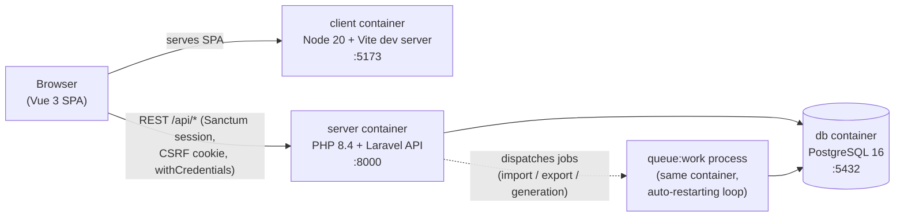
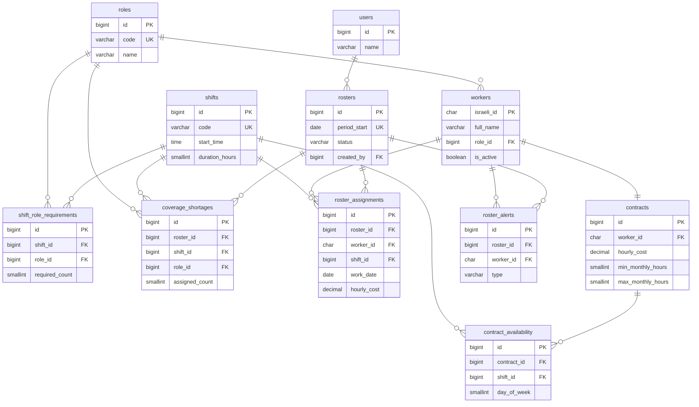

# Rostering System

A full-stack HR & Workforce Planning platform that unifies worker/contract management with automated 24/7 shift scheduling. 

The organisation runs three fixed daily shifts around the clock:


| Shift   | Label | Hours         | Staffing required per shift                 |
| ------- | ----- | ------------- | ------------------------------------------- |
| Morning | **A** | 00:00 – 08:00 | 6 General Guards, 2 Screeners, 1 Supervisor |
| Day     | **B** | 08:00 – 16:00 | 6 General Guards, 2 Screeners, 1 Supervisor |
| Evening | **C** | 16:00 – 00:00 | 6 General Guards, 2 Screeners, 1 Supervisor |


The only hard labour rule is: **a worker may never be assigned all 3 shifts of the same calendar day** (max 2 shifts/day), on top of each worker's individual contract constraints.

---

## Table of Contents

1. [Tech Stack](#tech-stack)
2. [System Architecture](#system-architecture)
3. [Setup & Run](#setup--run)
4. [Database Schema](#database-schema)
5. [Rostering Engine](#rostering-engine)
6. [CSV Import / Export Schema](#csv-import--export-schema)
7. [Sample Data & Test-Data Generator](#sample-data--test-data-generator)
8. [Bonus Features & Rationale](#bonus-features--rationale)
9. [Testing](#testing)
10. [API Overview](#api-overview)
11. [What I Would Improve With More Time](#what-i-would-improve-with-more-time)

---

## Tech Stack


| Layer            | Technology                                              |
| ---------------- | ------------------------------------------------------- |
| Backend          | PHP 8.4, Laravel 11                                     |
| Frontend         | Vue 3 SPA, Vue Router, Vite, TailwindCSS                |
| Database         | PostgreSQL 16 (relational SQL only)                     |
| Auth             | Laravel Sanctum (stateful SPA session + CSRF cookie)    |
| Background work  | Laravel database queue + dedicated `queue:work` process |
| Containerisation | Docker Compose (3 services: `db`, `server`, `client`)   |


---

## System Architecture




### Containers


| Service  | Container          | Port   | Description                                               |
| -------- | ------------------ | ------ | --------------------------------------------------------- |
| `db`     | `rostering_db`     | `5432` | PostgreSQL 16 (Alpine)                                    |
| `server` | `rostering_server` | `8000` | Laravel API.                                              |
| `client` | `rostering_client` | `5173` | Vite dev server hosting the Vue SPA. Talks to the API via |


### Key design decisions

- **API-first SPA split** — the Laravel backend is a pure JSON API; the Vue client is an independent app. Either side can be scaled, replaced, or deployed separately.
- **Asynchronous heavy work** — roster generation and CSV import/export run as **queued jobs**, not inside the HTTP request. The API returns immediately and the client polls a status endpoint. This keeps the request cycle fast regardless of workforce size (a core scalability requirement of the assignment).
- **Service-layer architecture** — controllers are thin; all business logic lives in `server/app/Services/` (`Rostering/`, `Workers/`), each class `final` with strict types. The rostering engine itself (`RosteringEngine`) is a pure in-memory algorithm with no framework coupling, which makes it unit-testable and easy to extend with a post-processing optimiser (e.g. simulated annealing) later.
- **Stateful Sanctum auth** — session cookie + CSRF token (no bearer tokens stored in JS), with single-active-session enforcement per user.

---

## Setup & Run

### Prerequisites

- Docker + Docker Compose
- `make`

### Production mode

```bash
make docker-init-prod
```

### Development mode

```bash
make docker-init
# or explicitly:
make docker-init-dev
```

### Open the app


| URL                                            | What                  |
| ---------------------------------------------- | --------------------- |
| [http://localhost:5173](http://localhost:5173) | Web application (SPA) |
| [http://localhost:8000](http://localhost:8000) | REST API              |


**Default login:** `test@example.com` / `password` (created by the seeder).

### Load sample workers

From the **Workers** page, click **Import** and upload one of the prepared CSVs in `server/database/data/` (or download `workers-sample.csv` via the "sample CSV" link inside the import modal):


| File                 | Workers | Use for                                                                                                 |
| -------------------- | ------- | ------------------------------------------------------------------------------------------------------- |
| `workers-sample.csv` | 12      | quick smoke test                                                                                        |
| `realistic.csv`      | 45      | a sustainable 30 / 10 / 5 workforce that fully staffs a month — the main roster demo                    |
| `optimization.csv`   | 54      | bimodal cheap/expensive pools with a bench, built to show the cost optimizer's savings in the benchmark |


All three share the same import schema. To seed data directly into the database instead of importing, use the `workers:seed` command — see [Sample Data & Test-Data Generator](#sample-data--test-data-generator).

### Useful Makefile targets


| Command                                                  | Purpose                         |
| -------------------------------------------------------- | ------------------------------- |
| `make docker-init-dev` / `make docker-init-prod`         | First-time setup (dev or prod)  |
| `make docker-up-dev` / `make docker-up-prod`             | Start dev or prod stack         |
| `make docker-down`                                       | Stop running stacks             |
| `make docker-rebuild-dev` / `make docker-rebuild-prod`   | Rebuild images and restart      |
| `make db-migrate` / `make db-rebuild`                    | Run migrations / fresh-migrate + seed (dev) |
| `make db-rebuild-prod`                                   | Fresh-migrate + seed (prod stack)           |
| `make db-seeders`                                        | Re-run seeders manually                     |
| `make db-psql`                                           | Open a `psql` shell             |
| `make test`                                              | Run the backend test suite      |
| `make server-logs` / `make client-logs` / `make db-logs` | Tail container logs             |
| `make server-app-logs`                                   | Tail `storage/logs/laravel.log` |
| `make artisan-command args="..."`                        | Run any artisan command         |


---

## Database Schema




PostgreSQL. Structural rules live in the DB (unique roster per month, 1:1 contracts, check constraints); scheduling rules (max 2 shifts/day, min/max hours, role demand) are enforced by the engine. `users` are admins only — workers never log in.

For column-level detail of each table — types, constraints, indexes, and design rationale — see the [database schema reference](schema.md).

---

## Rostering Engine

### Algorithm — greedy, most-constrained-first

1. **Build slots.** For each day of the target month × each `(shift, role)` requirement → one slot (date, shift, role, required count, shift duration).
2. **Order slots by scarcity.** Slots are sorted ascending by `required_count` (Supervisor ×1 → Screener ×2 → Guard ×6), then deterministically by role/date/shift. Filling the scarcest roles first is a *most-constrained-variable* heuristic: a supervisor slot has the fewest candidates, so it gets first pick of the workforce.
3. **Fill each slot greedily.** For every open position, score all eligible candidates and pick the best, updating live per-worker counters (assigned hours, shifts per day).

**Hard constraints checked at every placement:**

- Role must match the slot.
- Worker's contract must allow that day-of-week **and** that shift.
- Not already assigned to the same (date, shift).
- **Max 2 shifts per calendar day** (the no-3-shifts rule).
- `assigned_hours + shift_duration ≤ max_monthly_hours`.

**Scoring (soft goal):** candidates furthest below their `min_monthly_hours` (proportionally) win, which pushes everyone toward their contracted minimum. Ties break on lowest `israeli_id`, making generation fully **deterministic** — same input always yields the same roster, which makes it testable and debuggable.

### Alerts (required by the assignment)

- **Coverage shortage alert** — after generation, every (date, shift, role) where `assigned < required` is persisted to `coverage_shortages` and surfaced prominently in the UI *before* the roster is relied upon, detailing exactly which slots cannot be filled.
- **Per-worker hours shortfall alert** — every worker scheduled below their contractual `min_monthly_hours` produces a `roster_alerts` row listing `min_hours` vs `scheduled_hours`.

Both reports are **recomputed automatically** whenever the roster changes — manual add/remove of assignments, worker edits, or worker deletion — so they never go stale.

---

## CSV Import / Export Schema

### Worker CSV (import **and** export — round-trip compatible)

The export produces exactly this format, and the import accepts it unchanged, as required.

**Columns (header row required, in this order):**


| Column              | Type           | Rules                                                                         |
| ------------------- | -------------- | ----------------------------------------------------------------------------- |
| `full_name`         | string         | required, ≤ 255 chars                                                         |
| `israeli_id`        | string         | required, **exactly 9 digits** (also the upsert key)                          |
| `role`              | string         | required; one of `General Guard`, `Supervisor`, `Screener` (case-insensitive) |
| `status`            | string         | `Active` or `Inactive` (blank defaults to `Active`)                           |
| `hourly_cost`       | decimal        | 0 – 999999.99 (ILS)                                                           |
| `min_monthly_hours` | integer        | 0 – 744                                                                       |
| `max_monthly_hours` | integer        | 0 – 744, must be ≥ `min_monthly_hours`                                        |
| `00:00-08:00`       | day expression | availability for Shift A (see below)                                          |
| `08:00-16:00`       | day expression | availability for Shift B                                                      |
| `16:00-00:00`       | day expression | availability for Shift C                                                      |


**Day expression syntax** (per shift column): days are numbered `1` = Sunday … `7` = Saturday. Use single days, ranges, or both, joined with `|`. An empty cell means *not available for that shift*. At least one shift column must be non-empty.

**Import behaviour:**

- Runs as a **queued job**; the client polls progress and shows the final report.
- Each row is validated independently — **invalid rows are skipped and reported, the rest of the file still imports** (no all-or-nothing abort, per the assignment).
- Errors come back structured: `{ line, field, message }` for every problem (invalid ID, unknown role, bad day expression, max < min, duplicate `israeli_id` within the file, etc.).
- Rows **upsert** by `israeli_id`: existing workers are updated (contract + availability replaced), new ones are created. Re-importing a soft-deleted worker restores it. The result reports `total / imported / created / updated / skipped` counts.
- Imports that would invalidate an existing roster (e.g. lowering `max_monthly_hours` below already-scheduled hours) are rejected for that row, and roster reports are refreshed for every imported worker.
- Valid rows are persisted in chunks of 1,000 — large files import efficiently.

**Export:** Workers page → **Export** streams active directory workers (excluding archived/soft-deleted) with contract + availability as `workers-YYYY-MM-DD.csv` in the exact schema above.

The export is only enabled once the roster has **no coverage shortages**, so the numbers always describe a fully staffed, valid month.

---

## Sample Data & Test-Data Generator

### Prepared CSVs

`server/database/data/` ships three import-ready files — `workers-sample.csv` (12), `realistic.csv` (45), `optimization.csv` (54) — uploadable from the Workers page.

### Generate into the DB

`workers:seed` writes workers, contracts, and availability straight to the database via the model factories:

```bash
make artisan-command args="workers:seed realistic"
```


| Profile        | Roles (G/Scr/Sup) | Purpose                                                              |
| -------------- | ----------------- | -------------------------------------------------------------------- |
| `realistic`    | 30 / 10 / 5       | sustainable 24/7 workforce that fully staffs a month                 |
| `optimization` | 36 / 12 / 6       | bimodal cheap/expensive pools with a bench — shows optimizer savings |
| `shortage`     | 6 / 2 / 1         | deliberately undersized — exercises coverage & min-hours alerts      |


Flags: `--coverage-factor=N` (size), `--seed=N` (reproducible), `--fresh` (wipe workers first).

---

## Bonus Features & Rationale

### 1. Cost optimizer + objective selection

A simulated-annealing pass runs after the greedy build, swapping *who* fills each position to lower a multi-criteria objective (payroll cost + min-hours shortfall + even hour spread) while keeping every hard constraint and coverage intact. The trade-off is a user-picked preset — **Maximum Savings → Distribution Focused**. **Value:** the same roster can be tuned for budget or for balanced workloads on demand.

### 2. Generation benchmark

Generates the month twice — a baseline vs. a chosen objective — and reports the cost, hours, shortfall, and workload-spread deltas plus the per-worker changes. **Value:** quantifies what the optimizer actually saves before anything is committed, and doubles as a tuning aid for the objective weights.

### 3. Roster statistics grid

A per-worker view of any saved roster: scheduled hours against contractual min/max, utilisation, and projected cost, with leaderboards for highest-paid and most/least scheduled. **Value:** turns the roster into a management tool for budgeting, contract compliance, and fair-allocation review at a glance.

### Other enhancements

- **Fully async heavy work** — generation and import/export run on a queue with progress polling.
- **Regeneration** and client-side eligible-worker filtering in the manual-assignment modal.

---

## What I Would Improve With More Time

- **Snapshot scheduling targets on the roster** — min/max hours (and the shortfall, utilisation, and alerts derived from them) are read from the worker's *current* contract, so editing a contract retroactively rewrites a past roster's stats. Cost is already snapshotted per assignment; min/max should be too, so a finalised roster is an immutable record.
- **Preserve manual assignments on regeneration** — regenerate currently deletes every assignment, including `source = manual`; it should pin manual rows and only refill the auto positions around them.
- **Run the optimizer in place** — let the user re-run the cost optimizer on an existing roster *after* manual edits, optimizing only the auto positions and leaving manual selections untouched, instead of a full regenerate.
- **Concurrent-edit protection** — there is no guard today against two admins editing the same roster at once, optimistic locking (version / `updated_at` check) or per-roster locking would prevent silent overwrites.
- **Authorization layer** — every authenticated admin can do everything; a thin Policy/role split (e.g. viewer vs. editor) plus login rate-limiting would suit a confidential HR system.
- **Audit trail** — no record of who changed an assignment or contract and when; persisting an edit history would support HR/compliance review and pairs naturally with concurrent-edit protection.
- **Benchmarks** — more comparison options and per-worker optimization-change detail, and persist each run as a snapshot so results can be revisited and compared over time (today it is computed on the fly and discarded).
- **Frontend structure** — clearer feature folders and shared composables, keeping grid presentation, eligibility logic, and API calls separated instead of spread across views and lib files.
- **Better UX / UI** — a more polished design system, richer empty/loading/error states, drag-and-drop assignment editing.

