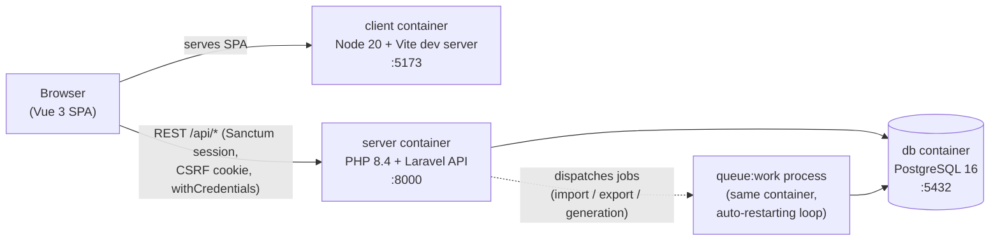
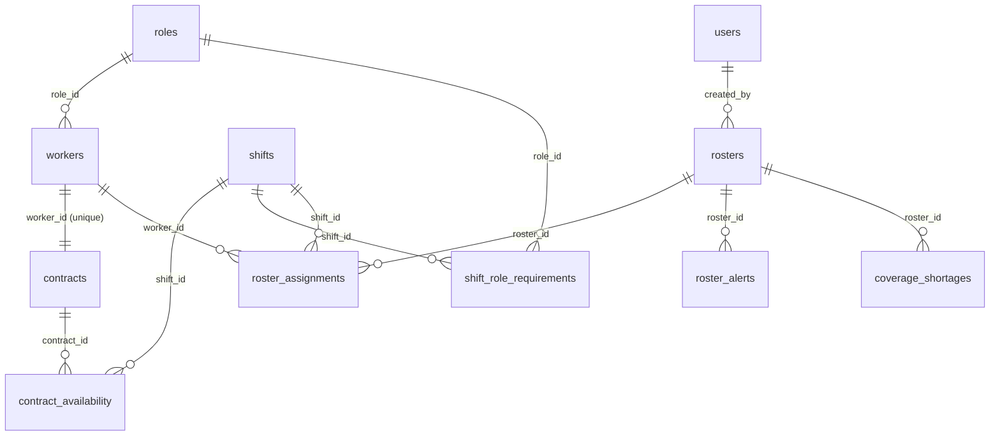

# Rostering System

A full-stack HR & Workforce Planning platform that unifies worker/contract management with automated 24/7 shift scheduling. 

The organisation runs three fixed daily shifts around the clock:


| Shift   | Label | Hours         | Staffing required per shift                 |
| ------- | ----- | ------------- | ------------------------------------------- |
| Morning | **A** | 00:00 – 08:00 | 6 General Guards, 2 Screeners, 1 Supervisor |
| Day     | **B** | 08:00 – 16:00 | 6 General Guards, 2 Screeners, 1 Supervisor |
| Evening | **C** | 16:00 – 00:00 | 6 General Guards, 2 Screeners, 1 Supervisor |


The only hard labour rule is: **a worker may never be assigned all 3 shifts of the same calendar day** (max 2 shifts/day), on top of each worker's individual contract constraints.

---

## Table of Contents

1. [Tech Stack](#tech-stack)
2. [System Architecture](#system-architecture)
3. [Setup & Run](#setup--run)
4. [Database Schema](#database-schema)
5. [Rostering Engine](#rostering-engine)
6. [CSV Import / Export Schema](#csv-import--export-schema)
7. [Sample Data & Test-Data Generator](#sample-data--test-data-generator)
8. [Bonus Features & Rationale](#bonus-features--rationale)
9. [Testing](#testing)
10. [API Overview](#api-overview)
11. [What I Would Improve With More Time](#what-i-would-improve-with-more-time)

---

## Tech Stack


| Layer            | Technology                                              |
| ---------------- | ------------------------------------------------------- |
| Backend          | PHP 8.4, Laravel 11                                     |
| Frontend         | Vue 3 SPA, Vue Router, Vite, TailwindCSS                |
| Database         | PostgreSQL 16 (relational SQL only)                     |
| Auth             | Laravel Sanctum (stateful SPA session + CSRF cookie)    |
| Background work  | Laravel database queue + dedicated `queue:work` process |
| Containerisation | Docker Compose (3 services: `db`, `server`, `client`)   |


---

## System Architecture




### Containers


| Service  | Container          | Port   | Description                                               |
| -------- | ------------------ | ------ | --------------------------------------------------------- |
| `db`     | `rostering_db`     | `5432` | PostgreSQL 16 (Alpine)                                    |
| `server` | `rostering_server` | `8000` | Laravel API.                                              |
| `client` | `rostering_client` | `5173` | Vite dev server hosting the Vue SPA. Talks to the API via |


### Key design decisions

- **API-first SPA split** — the Laravel backend is a pure JSON API; the Vue client is an independent app. Either side can be scaled, replaced, or deployed separately.
- **Asynchronous heavy work** — roster generation and CSV import/export run as **queued jobs**, not inside the HTTP request. The API returns immediately and the client polls a status endpoint. This keeps the request cycle fast regardless of workforce size (a core scalability requirement of the assignment).
- **Service-layer architecture** — controllers are thin; all business logic lives in `server/app/Services/` (`Rostering/`, `Workers/`), each class `final` with strict types. The rostering engine itself (`RosteringEngine`) is a pure in-memory algorithm with no framework coupling, which makes it unit-testable and easy to extend with a post-processing optimiser (e.g. simulated annealing) later.
- **Stateful Sanctum auth** — session cookie + CSRF token (no bearer tokens stored in JS), with single-active-session enforcement per user.

---

## Setup & Run

### Prerequisites

- Docker + Docker Compose
- `make` (optional but convenient — every command below has a raw equivalent)

### One-command start (development)

```bash
make docker-init          # alias for docker-init-dev
# or explicitly:
make docker-init-dev
```

This copies `.env.example` → `.env` for `server/`, `db/` and `client/` (if missing) and runs the **development** stack (`docker-compose.dev.yml`). No manual DB steps are needed — migrations and idempotent seeders (roles, shifts, staffing requirements, default user) run automatically on server boot.

**Development mode** (`docker-compose.dev.yml`):

- **Server** — `server/docker-start.sh`: full `composer install`, migrate, seed, queue worker, `artisan serve`
- **Client** — `client/docker-start.dev.sh`: `npm install` + **Vite dev server** with hot reload on `:5173`

Equivalent without `make`:

```bash
cp server/.env.example server/.env
cp db/.env.example db/.env
cp client/.env.example client/.env
docker compose -f docker-compose.dev.yml up -d --build
```

(`docker compose up` also works — root `docker-compose.yml` includes the dev file.)

### Production mode

```bash
make docker-init-prod
```

**Production mode** (`docker-compose.prod.yml`):

- **Server** — `server/docker-start.prod.sh`: `composer install --no-dev`, migrate, seed, Laravel config/route/view cache, queue worker, `artisan serve`
- **Client** — `client/docker-start.prod.sh`: `npm ci` → `vite build` → `vite preview` (serves the built static assets on `:5173`)

Equivalent without `make`:

```bash
docker compose -f docker-compose.prod.yml up -d --build
```

### Open the app


| URL                                            | What                  |
| ---------------------------------------------- | --------------------- |
| [http://localhost:5173](http://localhost:5173) | Web application (SPA) |
| [http://localhost:8000](http://localhost:8000) | REST API              |


**Default login:** `test@example.com` / `password` (created by the seeder).

### Load sample workers

From the **Workers** page, click **Import** and upload `server/database/data/workers-sample.csv` (13 workers), or download the same file via the "sample CSV" link inside the import modal. See [Sample Data & Test-Data Generator](#sample-data--test-data-generator) for generating larger datasets.

### Useful Makefile targets


| Command                                                  | Purpose                         |
| -------------------------------------------------------- | ------------------------------- |
| `make docker-init-dev` / `make docker-init-prod`         | First-time setup (dev or prod)  |
| `make docker-up-dev` / `make docker-up-prod`             | Start dev or prod stack         |
| `make docker-down`                                       | Stop running stacks             |
| `make docker-rebuild-dev` / `make docker-rebuild-prod`   | Rebuild images and restart      |
| `make db-migrate` / `make db-rebuild`                    | Run migrations / fresh-migrate  |
| `make db-seeders`                                        | Re-run seeders manually         |
| `make db-psql`                                           | Open a `psql` shell             |
| `make test`                                              | Run the backend test suite      |
| `make server-logs` / `make client-logs` / `make db-logs` | Tail container logs             |
| `make server-app-logs`                                   | Tail `storage/logs/laravel.log` |
| `make artisan-command args="..."`                        | Run any artisan command         |


---

## Database Schema




PostgreSQL. Structural rules live in the DB (unique roster per month, 1:1 contracts, check constraints); scheduling rules (max 2 shifts/day, min/max hours, role demand) are enforced by the engine. `users` are admins only — workers never log in.

### Lookup tables

`**roles**`


| Column | Type        | Notes                                              |
| ------ | ----------- | -------------------------------------------------- |
| `id`   | PK          | surrogate key for FKs                              |
| `code` | varchar(20) | unique — `general_guard`, `supervisor`, `screener` |
| `name` | varchar(50) | display label                                      |


`**shifts**`


| Column                    | Type     | Notes                                      |
| ------------------------- | -------- | ------------------------------------------ |
| `id`                      | PK       | surrogate key for FKs                      |
| `code`                    | char(1)  | unique — `A`, `B`, `C`                     |
| `start_time` / `end_time` | time     | shift window                               |
| `duration_hours`          | smallint | `check > 0` — used for monthly hour totals |


`**shift_role_requirements**` — staffing demand (6 / 2 / 1 per shift)


| Column           | Type        | Notes                          |
| ---------------- | ----------- | ------------------------------ |
| `shift_id`       | FK → shifts |                                |
| `role_id`        | FK → roles  |                                |
| `required_count` | smallint    | unique (`shift_id`, `role_id`) |


### HR & contracts

`**workers**`


| Column       | Type         | Notes                                            |
| ------------ | ------------ | ------------------------------------------------ |
| `israeli_id` | char(9) PK   | natural key; CSV upsert key                      |
| `full_name`  | varchar(255) |                                                  |
| `role_id`    | FK → roles   | restrict on delete                               |
| `is_active`  | boolean      | default `true`; inactive excluded from rostering |
| `deleted_at` | timestamp    | nullable; soft-deleted workers archived and hidden from default queries |


`**contracts**` — one per worker


| Column                                    | Type         | Notes                           |
| ----------------------------------------- | ------------ | ------------------------------- |
| `worker_id`                               | char(9) FK   | unique (1:1), cascade on delete |
| `hourly_cost`                             | decimal(8,2) | `check >= 0`                    |
| `min_monthly_hours` / `max_monthly_hours` | smallint     | `check (max >= min)`            |


`**contract_availability**` — one row per allowed (weekday, shift) pair


| Column        | Type           | Notes                                    |
| ------------- | -------------- | ---------------------------------------- |
| `contract_id` | FK → contracts | cascade on delete                        |
| `day_of_week` | smallint       | 0–6 (0 = Sunday); unique with `shift_id` |
| `shift_id`    | FK → shifts    | restrict on delete                       |


### Rostering

`**rosters**` — one row per calendar month


| Column                          | Type       | Notes                             |
| ------------------------------- | ---------- | --------------------------------- |
| `period_start`                  | date       | first day of month; unique        |
| `status`                        | varchar    | `processing` / `ready` / `failed` |
| `generated_at` / `published_at` | timestamp  | set when generation completes     |
| `created_by`                    | FK → users | restrict on delete                |


`**roster_assignments**` — core fact table (one worker × one shift × one date)


| Column      | Type         | Notes              |
| ----------- | ------------ | ------------------ |
| `roster_id` | FK → rosters | cascade on delete  |
| `worker_id` | char(9) FK   | restrict on delete |
| `shift_id`  | FK → shifts  | restrict on delete |
| `work_date` | date         |                    |
| `source`    | enum         | `auto` or `manual` |


Role is derived from `workers.role_id` (no `role_id` column on assignments). Unique (`roster_id`, `worker_id`, `work_date`, `shift_id`).

### Report snapshots

Refreshed after generation, regeneration, manual edits, and worker changes — read from storage, not recomputed on every page load.

`**roster_alerts**` — per-worker issues (today: hours below contract minimum)


| Column                          | Type         | Notes             |
| ------------------------------- | ------------ | ----------------- |
| `roster_id`                     | FK → rosters |                   |
| `type`                          | varchar      | `hours_shortfall` |
| `worker_id`                     | char(9) FK   |                   |
| `min_hours` / `scheduled_hours` | integer      |                   |


`**coverage_shortages**` — understaffed slots (no worker — keyed by date/shift/role)


| Column                              | Type         | Notes                 |
| ----------------------------------- | ------------ | --------------------- |
| `roster_id`                         | FK → rosters |                       |
| `work_date`                         | date         |                       |
| `shift_id` / `role_id`              | FK           |                       |
| `required_count` / `assigned_count` | integer      | demand vs actual fill |


Plus Laravel infra: `sessions`, `cache`, `jobs`, `failed_jobs`, `personal_access_tokens`.

### Key indexes


| Index                                                                     | Serves                                   |
| ------------------------------------------------------------------------- | ---------------------------------------- |
| `roster_assignments (roster_id, work_date, shift_id)`                     | Calendar grid reads                      |
| `roster_assignments` unique `(roster_id, worker_id, work_date, shift_id)` | Slot integrity + manual assign checks    |
| `roster_assignments (worker_id)`                                          | Per-worker hours, export, worker cleanup |
| `workers (role_id)`                                                       | Eligible-worker filtering by role        |
| `coverage_shortages (roster_id, work_date, shift_id)`                     | Shortage report load                     |


Assignments are bulk-inserted in chunks, so write overhead stays low even for full months.

---

## Rostering Engine

### Algorithm — greedy, most-constrained-first

1. **Build slots.** For each day of the target month × each `(shift, role)` requirement → one slot (date, shift, role, required count, shift duration).
2. **Order slots by scarcity.** Slots are sorted ascending by `required_count` (Supervisor ×1 → Screener ×2 → Guard ×6), then deterministically by role/date/shift. Filling the scarcest roles first is a *most-constrained-variable* heuristic: a supervisor slot has the fewest candidates, so it gets first pick of the workforce.
3. **Fill each slot greedily.** For every open position, score all eligible candidates and pick the best, updating live per-worker counters (assigned hours, shifts per day).

**Hard constraints checked at every placement:**

- Role must match the slot.
- Worker's contract must allow that day-of-week **and** that shift.
- Not already assigned to the same (date, shift).
- **Max 2 shifts per calendar day** (the no-3-shifts rule).
- `assigned_hours + shift_duration ≤ max_monthly_hours`.

**Scoring (soft goal):** candidates furthest below their `min_monthly_hours` (proportionally) win, which pushes everyone toward their contracted minimum. Ties break on lowest `israeli_id`, making generation fully **deterministic** — same input always yields the same roster, which makes it testable and debuggable.

### Alerts (required by the assignment)

- **Coverage shortage alert** — after generation, every (date, shift, role) where `assigned < required` is persisted to `coverage_shortages` and surfaced prominently in the UI *before* the roster is relied upon, detailing exactly which slots cannot be filled.
- **Per-worker hours shortfall alert** — every worker scheduled below their contractual `min_monthly_hours` produces a `roster_alerts` row listing `min_hours` vs `scheduled_hours`.

Both reports are **recomputed automatically** whenever the roster changes — manual add/remove of assignments, worker edits, or worker deletion — so they never go stale.

### Viewing & manual editing

The roster is displayed as a monthly/weekly grid (toggleable) showing every shift slot and its assigned workers. On top of the generated schedule you can:

- **Manually add** a worker to any slot (the API enforces the same hard constraints as the engine; the client pre-filters to eligible workers only).
- **Manually remove** any assignment.
- **Regenerate** the month (replaces auto assignments).

### Scalability of the engine

- Generation runs in a **queued job** with a generous timeout/memory budget — a 10× workforce never blocks an HTTP request.
- The engine works on plain in-memory data structures loaded in a handful of queries (no N+1 per slot), and assignments are **bulk-inserted in chunks**.
- Complexity is roughly *O(slots × candidates)* per month; slots are fixed by the calendar (~9 role-slots/day), so it scales linearly with workforce size.
- Demand (6/2/1) lives in the `shift_role_requirements` table, so changing staffing levels requires no code change.

---

## CSV Import / Export Schema

### Worker CSV (import **and** export — round-trip compatible)

The export produces exactly this format, and the import accepts it unchanged, as required.

**Columns (header row required, in this order):**


| Column              | Type           | Rules                                                                         |
| ------------------- | -------------- | ----------------------------------------------------------------------------- |
| `full_name`         | string         | required, ≤ 255 chars                                                         |
| `israeli_id`        | string         | required, **exactly 9 digits** (also the upsert key)                          |
| `role`              | string         | required; one of `General Guard`, `Supervisor`, `Screener` (case-insensitive) |
| `status`            | string         | `Active` or `Inactive` (blank defaults to `Active`)                           |
| `hourly_cost`       | decimal        | 0 – 999999.99 (ILS)                                                           |
| `min_monthly_hours` | integer        | 0 – 744                                                                       |
| `max_monthly_hours` | integer        | 0 – 744, must be ≥ `min_monthly_hours`                                        |
| `00:00-08:00`       | day expression | availability for Shift A (see below)                                          |
| `08:00-16:00`       | day expression | availability for Shift B                                                      |
| `16:00-00:00`       | day expression | availability for Shift C                                                      |


**Day expression syntax** (per shift column): days are numbered `1` = Sunday … `7` = Saturday. Use single days, ranges, or both, joined with `|`. An empty cell means *not available for that shift*. At least one shift column must be non-empty.


| Example   | Meaning                       |
| --------- | ----------------------------- |
| `1-7`     | every day                     |
| `1-5`     | Sunday–Thursday               |
| `2        | 4                             |
| `1-3      | 6-7`                          |
| *(empty)* | never available on this shift |


**Example rows:**

```csv
full_name,israeli_id,role,status,hourly_cost,min_monthly_hours,max_monthly_hours,00:00-08:00,08:00-16:00,16:00-00:00
Dana Cohen,234567816,Supervisor,Active,75.00,120,180,1-4,1-4,
Yossi Levi,314159260,General Guard,Active,52.50,80,160,1-7,1-7,1-7
Maya Bar,271828188,Screener,Inactive,60.00,0,120,,2|4|6,
```

**Import behaviour:**

- Runs as a **queued job**; the client polls progress and shows the final report.
- Each row is validated independently — **invalid rows are skipped and reported, the rest of the file still imports** (no all-or-nothing abort, per the assignment).
- Errors come back structured: `{ line, field, message }` for every problem (invalid ID, unknown role, bad day expression, max < min, duplicate `israeli_id` within the file, etc.).
- Rows **upsert** by `israeli_id`: existing workers are updated (contract + availability replaced), new ones are created. Re-importing a soft-deleted worker restores it. The result reports `total / imported / created / updated / skipped` counts.
- Imports that would invalidate an existing roster (e.g. lowering `max_monthly_hours` below already-scheduled hours) are rejected for that row, and roster reports are refreshed for every imported worker.
- Valid rows are persisted in chunks of 1,000 — large files import efficiently.

**Export:** Workers page → **Export** streams active directory workers (excluding archived/soft-deleted) with contract + availability as `workers-YYYY-MM-DD.csv` in the exact schema above.

### Roster analytics CSV (bonus feature — see rationale below)

Exported per roster from the roster details page:


| Column                         | Description                                                                |
| ------------------------------ | -------------------------------------------------------------------------- |
| `worker_id`                    | Israeli ID                                                                 |
| `worker_name`                  | Full name                                                                  |
| `roster_year` / `roster_month` | The roster period                                                          |
| `min_hours` / `max_hours`      | Contracted bounds                                                          |
| `actual_hours`                 | Hours actually scheduled this month                                        |
| `percent_of_max`               | Utilisation vs contractual maximum (can exceed 100 if manually overridden) |
| `percent_of_min`               | Progress toward the contracted minimum (capped at 100)                     |
| `total_cost`                   | `actual_hours × hourly_cost` (ILS) — the worker's projected monthly cost   |


The export is only enabled once the roster has **no coverage shortages**, so the numbers always describe a fully staffed, valid month.

---

## Sample Data & Test-Data Generator

### Sample CSV (assignment deliverable)

`server/database/data/workers-sample.csv` — 13 workers covering all three roles, active/inactive statuses, and varied availability patterns. It is also downloadable from inside the app (import modal → sample CSV).

### Workforce generator (for testing at scale)

`server/scripts/generate_workers_csv.py` produces import-ready CSVs of any size using purpose-built profiles:

```bash
# default: balanced profile, 50 workers
python3 server/scripts/generate_workers_csv.py

# fully covers a month with little/no shortage (22 guards / 8 screeners / 5 supervisors)
python3 server/scripts/generate_workers_csv.py --profile adequate

# deliberately undersized — exercises shortage & shortfall alerts (6/2/1)
python3 server/scripts/generate_workers_csv.py --profile shortage

# realistic 24/7 workforce: per-shift demand × coverage factor (default 5.0 → 30/10/5),
# workers take 1–2 days off per week and are spread across shifts round-robin
python3 server/scripts/generate_workers_csv.py --profile realistic
python3 server/scripts/generate_workers_csv.py --profile realistic --coverage-factor 4.8

# arbitrary size, reproducible output
python3 server/scripts/generate_workers_csv.py --count 80 --seed 42 --output server/database/data/workers-large.csv
```


| Profile     | Purpose                                                                                                                      |
| ----------- | ---------------------------------------------------------------------------------------------------------------------------- |
| `balanced`  | Random realistic mix of roles, availability, and a few inactive workers                                                      |
| `adequate`  | Sized so the engine can fill (almost) every slot — happy-path demos                                                          |
| `shortage`  | Too small on purpose — demonstrates coverage-shortage and min-hours alerts                                                   |
| `realistic` | Models a sustainable 24/7 workforce with days off and shift spread, forcing the engine to make genuine scheduling trade-offs |


Output defaults to `server/database/data/workers-generated.csv`; import it through the UI like any other file. Requires only Python 3 (standard library).

---

## Bonus Features & Rationale

The assignment requires at least two self-designed features with documented business value.

### Bonus 1 — Roster Analytics Export (per-month workforce statistics)

**What:** An **Export** button on every generated roster that produces a per-worker analytics CSV for the month: scheduled hours, utilisation against contractual minimum and maximum (`percent_of_min`, `percent_of_max`), and **total projected cost** (`actual_hours × hourly_cost`). Export is gated until the roster has zero coverage shortages, so the report always reflects a valid, fully staffed schedule. Generation runs as a queued job with download polling, so even very large months never block the UI.

**Business value:** This turns the roster from an operational artifact into a management tool. The contract data already contains hourly cost — this feature computes the numbers the Product Manager actually needs each month:

- **Budgeting / payroll forecasting** — the projected ILS cost of the month per worker and in total, *before* the month happens.
- **Contract compliance at a glance** — `percent_of_min` instantly shows who is below their contracted minimum (a contractual risk the assignment explicitly cares about), and `percent_of_max` shows who is being run close to their ceiling.
- **Fair-allocation review** — HR can spot over- and under-utilised workers and rebalance future months, reducing both burnout and contract violations.
- It's a CSV, so it drops straight into the spreadsheet workflows finance/HR teams already use.

### Additional enhancements beyond the spec

These weren't required but add genuine value:

- **Authentication with single active session** — Sanctum session auth protects all data; logging in elsewhere invalidates the previous session (sensible for a confidential HR system).
- **Fully asynchronous heavy operations** — roster generation and all CSV import/export run on a queue with progress polling; the UI never freezes on big datasets.
- **Live alert recomputation** — coverage shortages and hours shortfalls are refreshed automatically after every manual edit or worker change, so the alert panel is never stale.
- **Roster regeneration** — re-run the engine for an existing month after the workforce changes.
- **Week/month grid toggle** and client-side eligible-worker filtering in the manual assignment modal (only legal candidates are offered).

---

## API Overview

All routes are under `auth:sanctum` except login.


| Area                 | Endpoints                                                                                                                                                                                                                         |
| -------------------- | --------------------------------------------------------------------------------------------------------------------------------------------------------------------------------------------------------------------------------- |
| Auth                 | `POST /login`, `POST /logout`, `GET /api/user`                                                                                                                                                                                    |
| Workers              | `GET/POST /api/workers`, `GET/PUT/DELETE /api/workers/{id}`, `POST /api/workers/{id}/deactivate`, `POST /api/workers/{id}/restore`, `POST /api/workers/delete-all`, `POST /api/workers/restore-all`, `GET /api/workers/reference-data` (list supports `is_active`, `trashed=only\|with`) |
| Worker CSV           | `POST /api/workers/import`, `GET /api/workers/import/sample`, `GET /api/workers/import/{importId}` (poll), `POST /api/workers/export`, `GET /api/workers/export/{exportId}` (poll), `GET /api/workers/export/{exportId}/download` |
| Rosters              | `GET/POST /api/rosters`, `GET/DELETE /api/rosters/{id}`, `POST /api/rosters/{id}/regenerate`                                                                                                                                      |
| Roster analytics CSV | `POST /api/rosters/{id}/export`, `GET /api/rosters/{id}/export/{exportId}` (poll), `GET .../download`                                                                                                                             |
| Assignments          | `GET /api/rosters/{id}/assignments?from_date&to_date`, `POST /api/rosters/{id}/assignments`, `DELETE /api/rosters/{id}/assignments/{assignmentId}`                                                                                |


---

## What I Would Improve With More Time

- **Simulated annealing optimizer** — generate a fast baseline roster with the current greedy algorithm, then run simulated annealing to improve hour balance and reduce soft-constraint violations while preserving all hard constraints.
- **Roster cost optimisation mode** — expose the optimiser objective as a product choice (fairness-first vs. cost-first) and surface the projected savings vs. the baseline greedy schedule.
- **Assignment UX — fill shortages and reassign in place** — clicking a missing role in the grid would open an eligible-worker picker scoped to that date, shift, and role; each assigned worker would get a one-click reassign flow that atomically swaps them with another legal candidate instead of delete-then-add.
- **Roster change history** — persist an audit trail of manual adds, removals, and reassignments (who, when, before/after worker, date/shift/role) so managers can review edits and compliance can trace how a published roster evolved.
- **Store import summaries and row-level errors in a NoSQL store** — these results are ephemeral, can become large for big imports, and are only needed for polling and short-term review, making them a better fit than PostgreSQL.
- **Horizontal scaling** — Redis-backed queue with Horizon, multiple worker processes, and optional per-week parallel generation for very large workforces.
- **Frontend structure** — the SPA works but could be better organised: clearer feature folders (rosters vs. workers), shared composables for roster data loading, and tighter separation between grid presentation, eligibility logic, and API calls so new assignment flows do not spread across views and lib files.

